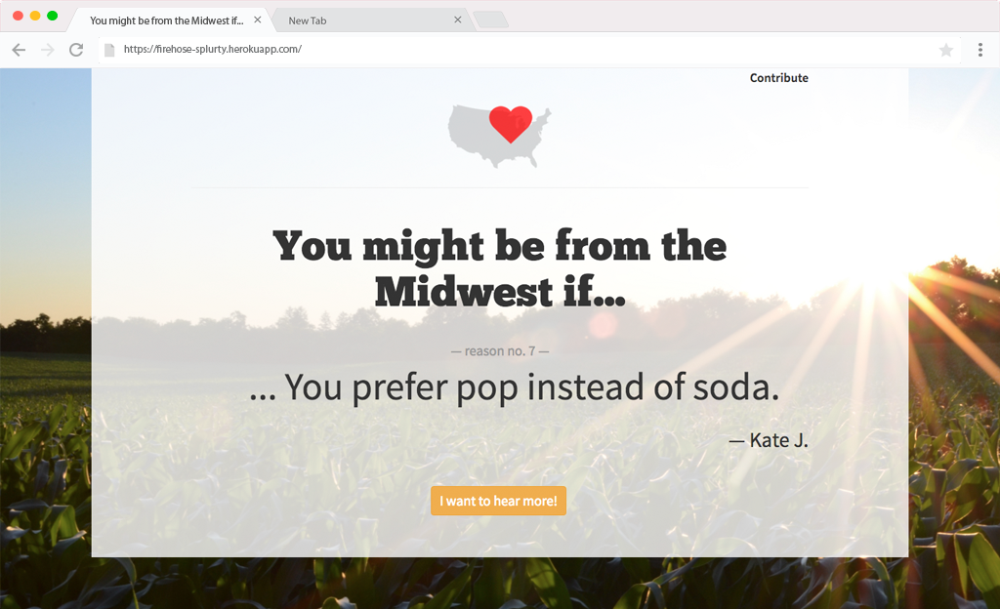

# Splurty

Splurty is a Ruby on Rails quote randomizer web application. Please contribute if you have a "You might be from the Midwest if..." quote of your own!

Visit the deployed application: [https://firehose-splurty.herokuapp.com/](https://firehose-splurty.herokuapp.com/)

___
### Implementation Details:
* Built on Ruby on Rails framework
* PostgreSQL database
* Twitter Bootstrap 3 for CSS and UI components
* Simple Form gem for form implementation
* Modal form quote submission
* Validation of form inputs
* Quotes randomly loaded from database & displayed upon page refresh
* Responsive design

___
### TODO:
```
- @TODO: User should see confirmation of successful quote submission and/or immediately see their quote displayed
- @TODO: Add note for user on form field requirements
- @TODO: Ask for user first name & last name but shorten display to 'First L.'
```

___
### Credits:
* [Unsplash](https://unsplash.com/) for background image

___
### Screenshot:

